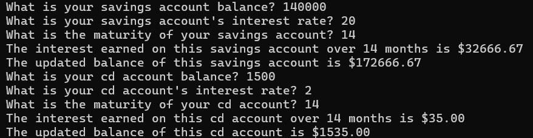

# customer_banking

# Sample Banking and Interest calculator

* This tool uses a basic interest calculation to allow the user to calculate the interest on their banking accounts.

* By allowing the user to input their own information the program can run interest calculations on a wide variety of accounts

* the function structure allows this program to be modularly used for other banking programs with little to no difficulty

## Example of program output
